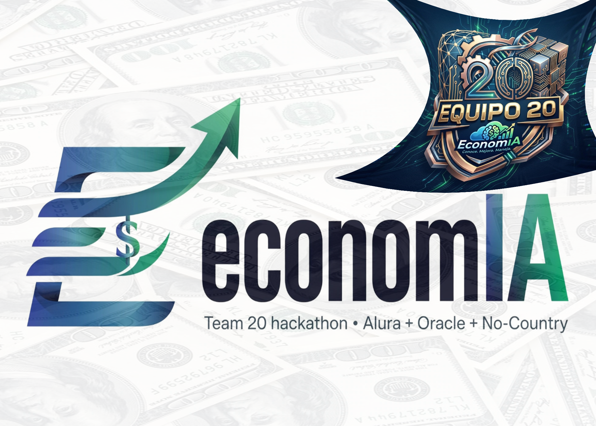
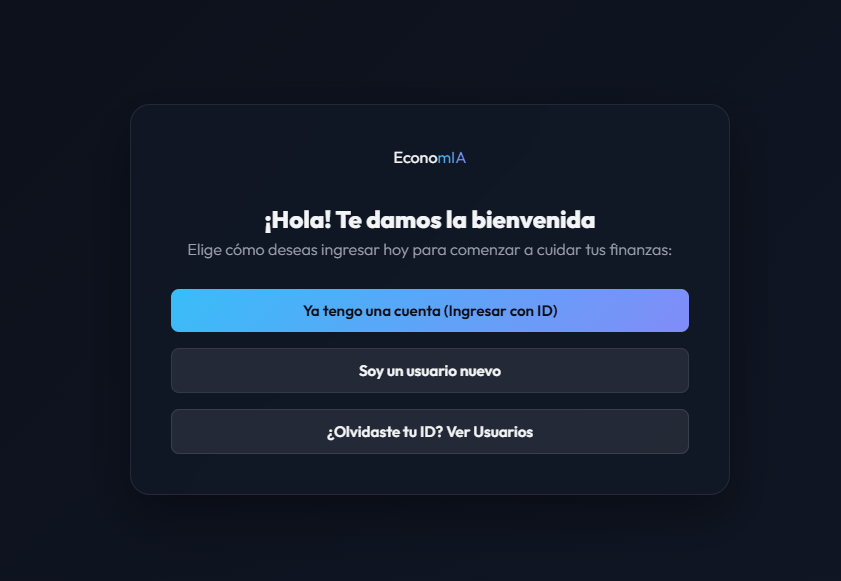

# EconomIA

Proyecto desarrollado para el Hackathon Oracle Next Education (ONE) y No Country
Equipo: G9 LATAM Team 20

<p align="center">
  
</p>

## 🙏 Agradecimientos 

Agradecemos a **Alura Latam**, **Oracle** y **No Country** por hacer posible este hackathon y brindarnos el espacio, las herramientas y el acompañamiento para aprender construyendo un proyecto real de verdad muchas gracias.

Gracias también a cada integrante del equipo por su tiempo y aportación en las distintas áreas del proyecto — este resultado es fruto del trabajo conjunto Team 20.

## 📖 Descripción

EconomIA es una plataforma web que ayuda a las personas a entender su situación financiera de forma simple. A partir de sus ingresos, gastos, meta de ahorro y nivel de deuda, la plataforma clasifica automáticamente sus movimientos por categoría usando un modelo de Machine Learning, calcula su perfil de salud financiera, y genera recomendaciones personalizadas y graduales para mejorar sus hábitos.

## 🎯 Problema

Muchas personas registran sus ingresos y gastos, pero les resulta difícil transformar esos datos en información útil para tomar mejores decisiones financieras. EconomIA convierte esos datos en un diagnóstico claro (saludable / en observación / en riesgo) y en pasos concretos para mejorar, sin necesitar conocimientos financieros previos.

## 🚀 Funcionalidades

- Registro y gestión de usuarios (CRUD completo)
- Registro y gestión de transacciones, con fecha y descripción (CRUD completo)
- Clasificación automática de gastos por categoría mediante un modelo de Machine Learning entrenado
- Sugerencia de categoría con nivel de confianza, visible para el usuario en tiempo real
- Resumen mensual: ingresos, gastos totales y desglose por categoría
- Cálculo del perfil de salud financiera, considerando ahorro real, meta personal de ahorro y nivel de deuda
- Recomendaciones personalizadas y graduales (mencionan la categoría específica de mayor gasto cuando es relevante)
- Dashboard interactivo con historial de movimientos, gráfica de distribución de gastos y estado de salud financiera

## 🛠 Tecnologías utilizadas

<p>
  
  
  
  
  
  
  
  
  
  
  
  
  
</p>

**Frontend**
- HTML5, CSS3, JavaScript (sin frameworks)
- Chart.js (visualización de datos)

**Backend**
- Python
- FastAPI
- SQLAlchemy
- Pydantic

**Ciencia de Datos / Machine Learning**
- Python
- Pandas, NumPy
- Scikit-Learn (TF-IDF + Regresión Logística)
- Joblib

**Base de datos**
- SQLite 
- PostgreSQL en Oracle Cloud Infrastructure 

**Cloud y despliegue**
- Oracle Cloud Infrastructure (OCI) Object Storage: Almacenamiento seguro del modelo serializado (`.joblib`) en la nube de Oracle
- Despliegue Backend: Aplicación web y API expuestas mediante servicios de nube modernos (Render)

**DevOps**
- Git, GitHub

## 🏗 Arquitectura

```
                  Usuario
                     │
                     ▼
      Frontend (HTML + CSS + JavaScript)
                     │
                     ▼
           Backend (FastAPI)
        ┌────────────┼────────────┐
        ▼            ▼            ▼
   Usuarios /   POST /clasificar-  Perfil financiero
 Transacciones      gasto          (reglas de negocio)
        │            │
        ▼            ▼
     SQLite    category_classifier_v1.joblib
  (→ PostgreSQL/OCI, en progreso)
```

## 📂 Estructura del proyecto

```
├── backend/
│   ├── main.py           # Rutas de la API
│   ├── models.py         # Modelos de la base de datos
│   ├── schemas.py        # Estructuras de entrada/salida
│   ├── database.py       # Configuración de la base de datos
│   └── modelos/
│       └── category_classifier_v1.joblib
├── frontend/
│   ├── index.html
│   ├── app.js
│   └── styles.css
├── .gitignore
└── README.md
```

## 📊 Flujo de funcionamiento

```
Registro / acceso del usuario
            ↓
Registro de transacciones (con descripción)
            ↓
Clasificación automática de categoría (Machine Learning)
            ↓
Cálculo del perfil financiero (reglas de negocio)
            ↓
Recomendación personalizada
            ↓
Visualización en el Dashboard
```
## ☁️ ¿Cómo funciona OCI Object Storage en EconomIA?

Para garantizar que la aplicación sea ligera y modular, el modelo de Machine Learning entrenado no se almacena directamente dentro del repositorio de código ni en el servidor de despliegue. Su funcionalidad en el sistema es la siguiente:

- **Almacenamiento en la Nube:** El archivo binario del modelo se aloja de forma segura en un bucket de Oracle Cloud Infrastructure (OCI) Object Storage.
- **Carga Dinámica:** Al iniciar o recibir peticiones de clasificación, el backend en FastAPI se conecta a OCI para descargar o consultar el modelo en tiempo real.
- **Escalabilidad:** Permite actualizar la versión del modelo de Machine Learning entrenado sin necesidad de redesplegar todo el código fuente de la aplicación web en Render.
  
  > Para la integración con OCI Object Storage, el backend consume el archivo `.joblib` directamente desde el Bucket de Oracle en tiempo     de ejecución, asegurando que el modelo esté centralizado en la infraestructura oficial  de Oracle Cloud.

## 🤖 Ciencia de Datos

El modelo de clasificación de gastos fue desarrollado a partir de un dataset propio construido por el equipo:

- Generación de un dataset sintético de descripciones de transacciones
- Separación train / validation / test agrupada por frase, para evitar fuga de información
- Representación del texto mediante TF-IDF de palabras y de caracteres
- Comparación de tres modelos (Regresión Logística, Complement Naive Bayes, Linear SVM), evaluados con F1 macro
- Selección de Regresión Logística por ofrecer probabilidades nativas, buen desempeño y un pipeline simple de integrar
- Iteración basada en análisis de errores: se reforzaron las categorías con más confusión (Educación, Servicios, Transporte) con nuevos ejemplos
- Resultado final: 77.8% de accuracy y 88.9% de accuracy considerando el top 3 de categorías sugeridas
- Serialización del pipeline completo (vectorizador + modelo) con Joblib

El modelo devuelve la categoría, el nivel de confianza, y las 3 categorías más probables — si la confianza es menor al umbral definido, se marca para revisión del usuario.

Está en desarrollo un segundo modelo de análisis financiero, que calculará un score y diagnóstico a partir de indicadores mensuales más amplios (financiamiento, inversiones, gasto recurrente vs. variable, promedio de balance de 3 meses). Su integración se hará una vez definido el formato final, sin reemplazar el sistema de reglas de negocio ya funcional.

## 🔌 API

| Método | Endpoint | Descripción |
|---|---|---|
| GET | `/` | Verifica que la API esté corriendo |
| POST | `/usuarios` | Registra un nuevo usuario |
| GET | `/usuarios` | Lista todos los usuarios |
| GET | `/usuarios/{usuario_id}` | Consulta un usuario |
| PUT | `/usuarios/{usuario_id}` | Actualiza un usuario |
| DELETE | `/usuarios/{usuario_id}` | Elimina un usuario |
| POST | `/transacciones` | Registra una transacción |
| GET | `/transacciones/{usuario_id}` | Lista las transacciones de un usuario |
| PUT | `/transacciones/{transaccion_id}` | Actualiza una transacción |
| DELETE | `/transacciones/{transaccion_id}` | Elimina una transacción |
| GET | `/resumen-mensual/{usuario_id}` | Resumen de ingresos, gastos y categorías del mes |
| GET | `/perfil/{usuario_id}` | Calcula el perfil de salud financiera y su recomendación |
| POST | `/clasificar-gasto` | Clasifica una descripción de gasto usando el modelo de Machine Learning |

## 📅 Estado del proyecto

- ✅ Diseño de la arquitectura
- ✅ Generación del dataset sintético del clasificador
- ✅ Entrenamiento y evaluación del modelo de clasificación de gastos
- ✅ Desarrollo del backend (FastAPI) con CRUD completo de usuarios y transacciones
- ✅ Cálculo del perfil financiero con reglas de negocio explicables
- ✅ Integración del modelo de clasificación de gastos en el backend
- ✅ Desarrollo del frontend con dashboard interactivo
- ✅ Modelo de análisis financiero (en desarrollo por el equipo de Data Science)
- ✅ Almacenamiento y gestión del modelo de Machine Learning en OCI Object Storage
- ✅ Autenticación de usuarios
- ✅ Despliegue en Render
- ⬜ Presentación final del proyecto

## 👥 Equipo

**G9 LATAM Team 20**

Equipo multidisciplinario participante del Hackathon Oracle Next Education (ONE) y No Country.

Desarrollo de Backend, Frontend, Ciencia de Datos, Machine Learning e Integración Cloud.

## 👥 Equipo

**G9 LATAM Team 20**

Equipo multidisciplinario participante del Hackathon Oracle Next Education (ONE) y No Country.

 <table align="center">
  <tr>
    <td align="center" width="180">
      
      <br />
      <b>Alexis Parra</b>
      <br />
      <small>Ing. Mecatrónica</small>
      <br />
      <sub><em><strong>Fronten - Backend</strong></em></sub>
      <br />
      <a href="https://www.linkedin.com/in/jose-luis-alexis-parra-díaz-a59029176/" target="_blank">LinkedIn</a>
    </td>
    <td align="center" width="180">
      
      <br />
      <b>Karen Itzel</b>
      <br />
     <small>Ing. En Sistemas</small>
      <br />
      <sub><em><strong>Backend - Integracion OCI</strong></em></sub>
       <br />
      <a href="https://www.linkedin.com/in/karen-itzel-jaime-castillo/" target="_blank">LinkedIn</a>
    </td>
    <td align="center" width="180">
      
      <br />
      <b>Guillermo Salazar</b>
      <br />
     <small>Arq. Licenciado</small>
      <br />
      <sub><em><strong>Ciencia de Datos</strong></em></sub>
       <br />
      <a href="https://www.linkedin.com/in/guillermo-sa-ma/" target="_blank">LinkedIn</a>
    </td>
    <td align="center" width="180">
      
      <br />
      <b>Argenes Moreno</b>
      <br />
     <small>Ing. Industrial</small>
      <br />
      <sub><em><strong>Ciencia de Datos</strong></em></sub>
       <br />
      <a href="https://www.linkedin.com/in/oscar-argenes-moreno-navarrete/" target="_blank">LinkedIn</a>
    </td>
  </tr>
  </tr>
  
</table>


## 👥 Capturas

**G9 LATAM Team 20 EconimIA**
<h2 align="center">G9 LATAM Team 20 EconimIA</h2>

<table align="center" width="100%">
  <!-- FILA 1: Imagen Principal Arriba (Ocupa las 3 columnas) -->
  <tr>
    <td align="center" colspan="4">
      
      <br />
      <b>Primera pantalla de bienvenida y acceso</b>
      <br />
      <sub>Se muestra el acceso mediante usuario y contraseña. En caso de no recordar el usuario, muestra la lista de usuarios registrados.</sub>
      <br /><br />
    </td>
  </tr>

  <!-- FILA 2: datos de inicio -->
  <tr>
    <td align="center" width="50%">
      
      <br />
      <b>Panel de registro</b>
      <br />
      <sub>Captura primeros datos de cuenta: usuario y contraseña.</sub>
    </td>
    <td align="center" width="50%">
      
      <br />
      <b>Mensaje de bienvenida</b>
      <br />
      <sub>Informacion amigable con el usuario</sub>
    </td>
  </tr>

  <!-- fila3: datos de inicio -->
  <tr>
    <td align="center" width="50%">
      
      <br />
      <b>Definición Meta de Ahorro Usuario</b>
      <br />
      <sub>Captura el porcentaje que el usuario desea ahorrar</sub>
      </td>
      <td align="center" width="50%">
      
      <br />
      <b>Definicion de uso</b>
      <br />
      <sub>Se hace consciente al usuario para que será su esfuerzo de ahorro  en el uso de la app </sub>
      </td>

  </tr>
   
  <!-- se completan los datos -->
  <tr>
      <td align="center" colspan="4">
      
      <br />
      <b>Panel para completar datos de usuario </b>
      <br />
      <sub>Se capturan los datos del perfil de usuario completos incluido su porcentaje de deuda de sus ingresos totales </sub>
      <br /><br />
    </td>
  </tr>

  <!-- confirmacion de perfil -->
  <tr>
      <td align="center" colspan="4">
      
      <br />
      <b>Se informa al usuario el numero re registro que tiene su perfil </b>
      <br />
      <sub>Este sera su ID para entrar y registrarse a su cuenta</sub>
      <br /><br />
    </td>
  </tr>


<!-- FILA 4: dentro de la app -->
  <tr>
    <td align="center" width="50%">
      
      <br />
      <b>Panel de salud</b>
      <br />
      <sub>Un vistaso general a la salud del usuario el mes seleccionado</sub>
    </td>
    <td align="center" width="50%">
      
      <br />
      <b>Panel de resumen</b>
      <br />
      <sub>Resumen de sus gastos mostrando montos y categorias</sub>
    </td>
  </tr>

  <!-- FILA 4: dentro de la app -->
  <tr>
    <td align="center" width="50%">
      
      <br />
      <b>Panel para registrar movimientos</b>
      <br />
      <sub>Aquí el usuario realiza el registro de sus actividades económicas y el motor de IA selecciona automáticamente la categoría, dejando también la opción por si el usuario quiere asignarlo a otra para controlar sus gastos de manera más personalizada</sub>
      </td>
      <td align="center" width="50%">
      
      <br />
      <b>Edicion de datos</b>
      <br />
      <sub>El usuario siempre puede editar sus datos según varíen sus ingresos mensuales así como hacer correcciones en su nombre o ciudad cualquier dato relacionado a su perfil excepto el cambio de ID ese es único por usuario </sub>
      </td>

  </tr>


   <!-- Economia -->
  <tr>
      <td align="center" colspan="4">
      
      <br />
      <b>Panel de EcnomIA</b>
      <br />
      <sub>Dentro de este panel se muestra un análisis realizado con reglas de negocio personales según los datos del usuario mostrando un score para su cumplimiento y un sistema de recompensa en puntos dependiendo de que tan bien estén controlados sus gastos y sus metas personales de ahorro </sub>
      <br /><br />
    </td>
  </tr>

 <!-- Economia -->
  <tr>
      <td align="center" colspan="4">
      
      <br />
      <p>URL activa despues del dia demo </p>
      <br />
      <b>La API cuenta con documentación interactiva generada automáticamente por FastAPI, disponible psrs cualquiera</b>
      <ul>
       <li>endpoints (/usuarios, /perfil, /perfil-ia, /clasificar-gasto, etc.)</li>
       <li>Qué datos espera cada uno (schemas de Pydantic)</li>
       <li>Qué devuelve cada uno</li>
       <li>Y pueden probarlos en vivo desde ahí mismo</li>
      </ul>
      <br />
      <sub></sub>
      <br /><br />
    </td>
  </tr>

</table>

## 📄 Licencia

Proyecto desarrollado con fines educativos para el Hackathon Oracle Next Education (ONE), organizado por Alura Latam, Oracle y No Country. Su propósito es demostrar la integración de tecnologías de desarrollo web, ciencia de datos y machine learning para resolver un problema real relacionado con la educación financiera. Los datos utilizados son sintéticos y no deben interpretarse como información financiera real.


